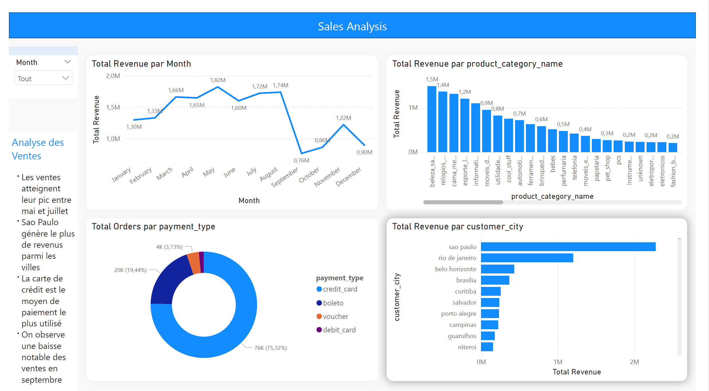
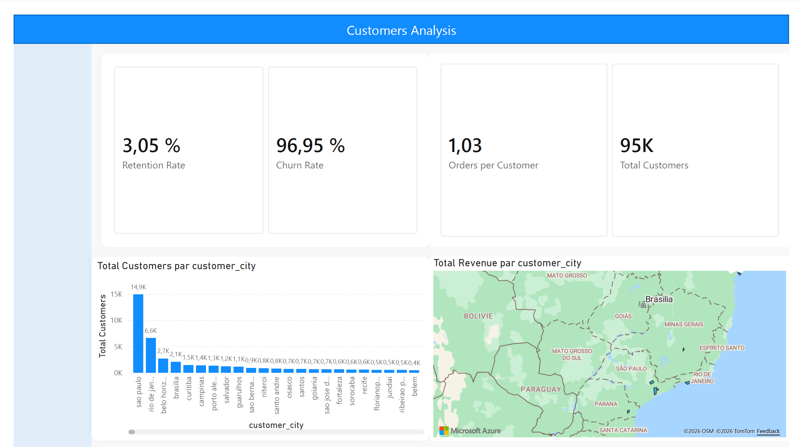
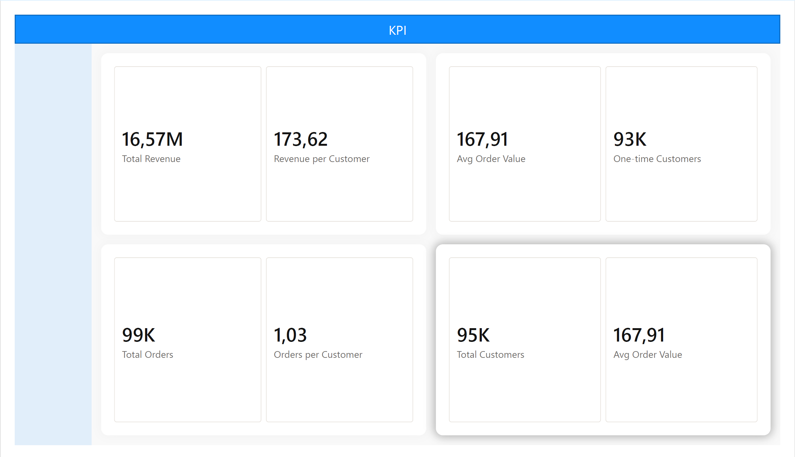

# 📊 E-commerce Sales Analysis – Python & Power BI

## 📌 Présentation du projet

Ce projet vise à analyser un dataset **e-commerce** afin de comprendre les performances commerciales, les tendances de vente et le comportement des clients.

L’analyse combine deux outils principaux :

- **Python** pour la préparation, le nettoyage et l’analyse exploratoire des données
- **Power BI** pour la création d’un **dashboard interactif**

L’objectif est de transformer des données transactionnelles brutes en **insights business exploitables** pour améliorer la prise de décision.

---

# 🎯 Objectifs du projet

Les principaux objectifs de cette analyse sont :

- analyser la performance globale des ventes
- identifier les catégories de produits les plus performantes
- comprendre le comportement d’achat des clients
- mesurer les indicateurs clés de performance (**KPI**)
- analyser la distribution géographique des ventes
- mesurer la rétention et le churn des clients
- construire un dashboard interactif pour le suivi de la performance commerciale

---

# 📂 Dataset

Le dataset utilisé provient du **Brazilian E-commerce Public Dataset by Olist**.

Il contient plusieurs tables transactionnelles liées à l’activité d’une plateforme e-commerce brésilienne :

- commandes
- clients
- paiements
- produits
- vendeurs
- avis clients
- géolocalisation

## Source du dataset

Dataset original :

https://www.kaggle.com/datasets/olistbr/brazilian-ecommerce

⚠️ Le dataset brut n’est pas inclus dans ce repository en raison de sa taille.

---

# 🛠️ Technologies utilisées

Ce projet a été réalisé avec les outils suivants :

- Python
- Pandas
- Matplotlib
- Seaborn
- Jupyter Notebook
- Power BI
- DAX

Ces outils permettent de réaliser :

- le nettoyage des données
- l’analyse exploratoire
- la visualisation des données
- la création de dashboards interactifs

---

# 🧹 Étapes du projet

## 1️⃣ Importation et préparation des données

La première étape a consisté à importer les différentes tables du dataset et à analyser leur structure.

Les principales tables utilisées :

- `customers`
- `orders`
- `order_items`
- `payments`
- `products`

Cette étape permet de comprendre :

- les types de variables
- la structure du dataset
- les relations entre les tables

---

## 2️⃣ Nettoyage des données

Avant toute analyse, les données ont été nettoyées afin d’améliorer leur qualité.

### Principales actions réalisées

- gestion des valeurs manquantes
- conversion des colonnes de dates
- suppression des doublons
- harmonisation de certaines variables
- vérification des incohérences

### Variables calculées

Plusieurs variables ont été créées pour faciliter l’analyse :

- `delivery_time`
- `delivery_delay`
- `revenue`
- `order_year`
- `order_month`

---

## 3️⃣ Fusion des tables

Les différentes tables ont été fusionnées afin de créer une table analytique unique :
ecomerce_final

Cette table contient :

- les informations clients
- les informations commandes
- les informations produits
- les informations de paiement
- les variables temporelles

---

# 🔎 Analyse exploratoire des données (EDA)

Une analyse exploratoire a été réalisée afin d’identifier les tendances et patterns dans les données.

## Analyses réalisées

### Vue d’ensemble du dataset

- dimensions du dataset
- types de variables
- valeurs manquantes

### Résumé statistique

Analyse des statistiques pour :

- prix
- revenus
- délais de livraison

### Distribution des variables

Analyse des distributions pour :

- prix
- chiffre d’affaires
- délais de livraison

### Analyse des variables catégorielles

Étude des variables :

- catégories de produits
- méthodes de paiement
- villes
- états

### Analyse des corrélations

Identification des relations entre :

- prix
- revenus
- frais de livraison

### Analyse des valeurs aberrantes

Détection des valeurs extrêmes pour :

- `price`
- `revenue`
- `delivery_time`

---

# 📈 Analyse business

Après l’EDA, plusieurs analyses business ont été réalisées.

## Analyse des ventes

- évolution du chiffre d’affaires dans le temps
- catégories de produits les plus rentables
- villes générant le plus de revenus
- répartition des ventes par méthode de paiement

---

## Analyse client

- nombre total de clients
- nombre de commandes par client
- clients ayant effectué une seule commande
- clients récurrents

---

## Analyse de rétention et churn

La rétention a été analysée à partir du nombre de commandes par client.

- client récurrent : plus d’une commande
- client one-time : une seule commande

Ces indicateurs permettent de mesurer :

- le **Retention Rate**
- le **Churn Rate**

---

# 📊 Indicateurs clés de performance (KPI)

Le dashboard Power BI inclut les KPI suivants :

- Total Revenue
- Total Customers
- Total Orders
- Orders per Customer
- Average Order Value
- Retention Rate
- Churn Rate
- One-time Customers
- Average Delivery Time

---

# 📊 Dashboard Power BI

Un dashboard interactif a été créé avec **Power BI** pour visualiser les résultats.

---

## 📉 Sales Analysis

Cette page analyse la performance commerciale.

### Visualisations

- chiffre d’affaires par mois
- revenu par catégorie de produit
- commandes par méthode de paiement
- revenu par ville

### Insights

- pic des ventes entre **mai et juillet**
- **carte bancaire** comme principal moyen de paiement
- forte concentration du revenu dans certaines grandes villes

---

## 👥 Customer Analysis

Cette page analyse le comportement des clients.

### KPI

- Retention Rate
- Churn Rate
- Orders per Customer
- One-time Customers
- Total Customers

### Visualisations

- clients par ville
- revenus par ville
- carte géographique des revenus

---

## 📌 KPI Dashboard

Cette page synthétise les indicateurs les plus importants pour suivre la performance commerciale.

---

# 🔎 Insights principaux

Les principaux enseignements tirés de l’analyse sont :

- les ventes présentent une **saisonnalité**
- la majorité des clients effectue **une seule commande**
- le **taux de rétention est faible**
- les revenus sont concentrés dans quelques grandes villes

Ces résultats suggèrent qu’une stratégie de **fidélisation client** pourrait améliorer la performance commerciale.

---

# 🖼️ Aperçu du dashboard

## Sales Analysis



---

## Customer Analysis



---

## KPI Dashboard



---

# 📁 Structure du projet

```
E-commerce-Sales-Analysis
│
├── images
│   ├── sales_analysis.png
│   ├── customer_analysis.png
│   └── kpi_dashboard.png
│
├── notebook
│   └── ecommerce_analysis.ipynb
│
├── powerbi
│   └── Ecommerce_Sales_Analysis_PowerBI.pbix
│
└── README.md
```

---

# 🚀 Améliorations futures

Les améliorations possibles incluent :

- segmentation client (RFM)
- modèle prédictif de churn
- prévision des ventes
- recommandation de produits

---

# 💼 Compétences démontrées

Ce projet démontre les compétences suivantes :

- Data Cleaning
- Exploratory Data Analysis
- Data Visualization
- Business Analytics
- Power BI Dashboard Development
- KPI Analysis

---

# 👨‍💻 Auteur

Cliford Cupidon

Projet réalisé dans le cadre du développement d’un **portfolio Data Analyst**.
